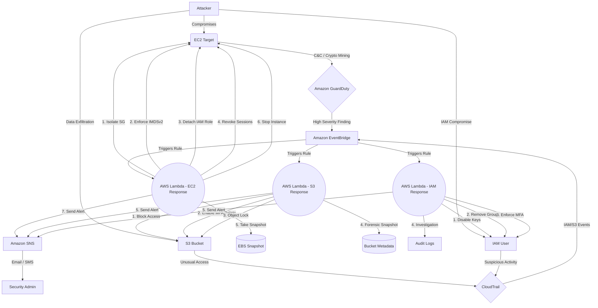

# AWS Serverless Security Orchestration, Automation, and Response (SOAR)

This project demonstrates a fully automated Serverless Incident Response architecture on AWS. It detects malicious activity using Amazon GuardDuty and automatically isolates the compromised EC2 instance while preserving its state for forensic investigation.

## 🏛️ Architecture



The workflow involves:
1. **Detection:** Amazon GuardDuty detects anomalous behavior with severity >= 7.0 (e.g., EC2 communicating with a known C&C server).
2. **Event Routing:** Amazon EventBridge intercepts the GuardDuty finding based on an event rule.
3. **Automation Logic:** An AWS Lambda function (Python/Boto3) is triggered.
4. **Resolution (Response Playbook):** 
   - **Isolate:** Modifies the EC2 instance Security Group to an `Isolation SG` (0 ingress/egress).
   - **IMDSv2 Enforce:** Enforces IMDSv2 to prevent further SSRF-based metadata and credential theft.
   - **Revoke:** Disassociates any attached IAM Instance Profiles.
   - **Kill Sessions:** Attaches an inline `Deny All` IAM policy with a `aws:TokenIssueTime` condition to immediately revoke any cached local credentials the hacker might be using.
   - **Preserve:** Takes an EBS Snapshot of the compromised instance for forensics.
   - **Tag:** Tags the instance as `Compromised: True`.
   - **Stop:** Halts the instance process completely.
   - **Alert:** Sends an alert notification securely via Amazon SNS.

## 🕵️ Threat Scenario

**Scenario:** An attacker discovers a Remote Code Execution (RCE) vulnerability on your public-facing application and installs a Monero cryptocurrency miner.

**Detection:** The malware begins making outbound DNS requests to known mining pools (e.g., `pool.minexmr.com`). GuardDuty analyzes the DNS logs and flags the instance with a *High-Severity* finding (`CryptoCurrency:EC2/BitcoinTool.B`).

**Response:** Within seconds, the SOAR workflow executes. The instance is yanked off the network, its metadata endpoint is locked down, all active AWS privileges are explicitly revoked, its hard drive is snapshotted for the Blue Team, and the server shuts down.

## 🗂️ Project Structure
- `src/`: Python code for the AWS Lambda responders.
  - `lambda_function.py`: Main EC2 incident response playbook
  - `s3_exfiltration_response.py`: S3 data exfiltration detection and response
  - `iam_compromise_response.py`: IAM compromise detection and response
- `terraform/`: Infrastructure as Code (IaC) definitions to deploy all AWS resources.
- `attack_simulation/`: Bash scripts to emulate malicious behavior and trigger the SOAR logic.

## 🚀 Deployment Instructions

### Prerequisites
- [Terraform](https://www.terraform.io/downloads.html) installed locally.
- AWS CLI installed and configured (`aws configure`).

### Setup
1. Clone the repository and navigate to the terraform directory:
   ```bash
   cd terraform
   ```
2. Initialize and Apply Terraform:
   ```bash
   terraform init
   
   # During apply, it will prompt for the variable: alert_email
   # Enter your email address to receive SOAR notifications
   terraform apply
   ```
3. **Important:** After the first apply, check the email address you provided. AWS SNS requires you to click a confirmation link to subscribe to the security alerts.

## ⚔️ Simulation Guide: Triggering GuardDuty
Amazon GuardDuty costs money and takes time to learn behavior. To immediately see this SOAR architecture in action without waiting for real hackers, we can generate sample findings.

**Method 1: Using AWS CLI (Easiest)**
Generate sample GuardDuty findings that EventBridge will catch:

```bash
# 1. Get your Detector ID (Terraform output)
aws guardduty list-detectors

# 2. Ask GuardDuty to generate a sample finding for your EC2
aws guardduty create-sample-findings \
  --detector-id <YOUR_DETECTOR_ID> \
  --finding-types "Backdoor:EC2/C&CActivity.B"
```
*Note: Depending on how AWS generates the sample, the sample finding might use a fake Instance ID rather than your actual deployed EC2. But you will still see the Lambda execution trigger in CloudWatch logs.*

**Method 2: Use Attack Simulation Scripts (Realistic)**
Use the provided bash scripts to generate real network traffic patterns that GuardDuty flags as malicious.

1. SSH into the `target_ec2_public_ip` (provided in Terraform outputs).
2. Upload and run the scripts in `attack_simulation/`:
   ```bash
   # Run the fake crypto miner
   chmod +x attack_simulation/crypto_miner.sh
   ./attack_simulation/crypto_miner.sh
   ```
3. **Wait:** GuardDuty typically takes 15-20 minutes to generate and propagate an actual finding for continuous traffic. 
4. **Observe:** Check your email. The SOAR logic will fire, taking an EBS Snapshot, detaching its IAM roles, and destroying your SSH connection (by swapping the Security Group).

## 🛡️ Additional Security Playbooks

### 1. S3 Data Exfiltration Detection & Response
**Detection:** Monitors CloudTrail logs for unusual S3 access patterns including:
- Large volume downloads (>10GB threshold)
- High frequency access (>1000 operations/24hrs)
- Multiple source IPs
- Off-hours access patterns

**Response Actions:**
- Block user access via bucket policies
- Enable S3 protection features (MFA Delete, Object Lock)
- Create forensic snapshots of bucket metadata
- Send security alerts with detailed analysis

**Trigger:** CloudTrail events for S3 `GetObject`, `ListObjects`, `DownloadFile` operations

### 2. IAM Compromise Detection & Response
**Detection:** Analyzes IAM audit events for suspicious activities:
- Privilege escalation attempts
- Unusual source IPs
- Failed login patterns
- Concurrent sessions from different locations
- Suspicious timing (off-hours changes)

**Response Actions:**
- Disable compromised user access keys
- Remove from privileged IAM groups
- Enforce MFA requirements
- Conduct comprehensive investigation
- Send detailed security alerts

**Trigger:** CloudTrail events for IAM operations (CreateUser, AttachPolicy, etc.)

## 🎯 Deployment for New Playbooks

To deploy the additional security playbooks:

1. **S3 Exfiltration Response:**
   ```bash
   # Deploy Lambda function
   aws lambda create-function \
     --function-name s3-exfiltration-response \
     --runtime python3.9 \
     --role <your-lambda-execution-role> \
     --handler s3_exfiltration_response.lambda_handler \
     --zip-file fileb://s3_exfiltration_response.zip \
     --environment Variables='{SNS_TOPIC_arn=<your-sns-topic>,EXFILTRATION_THRESHOLD=10737418240}'
   
   # Create EventBridge rule for S3 events
   aws events put-rule \
     --name s3-exfiltration-detection \
     --event-pattern '{"source":["aws.s3"],"detail-type":["AWS API Call via CloudTrail"],"detail":{"eventSource":["s3.amazonaws.com"],"eventName":["GetObject","ListObjects"]}}'
   
   # Add Lambda target
   aws events put-targets \
     --rule s3-exfiltration-detection \
     --targets '{"Id": "1","Arn": "<your-lambda-arn>"}'
   ```

2. **IAM Compromise Response:**
   ```bash
   # Deploy Lambda function
   aws lambda create-function \
     --function-name iam-compromise-response \
     --runtime python3.9 \
     --role <your-lambda-execution-role> \
     --handler iam_compromise_response.lambda_handler \
     --zip-file fileb://iam_compromise_response.zip \
     --environment Variables='{SNS_TOPIC_arn=<your-sns-topic>}'
   
   # Create EventBridge rule for IAM events
   aws events put-rule \
     --name iam-compromise-detection \
     --event-pattern '{"source":["aws.iam"],"detail-type":["AWS API Call via CloudTrail"]}'
   
   # Add Lambda target
   aws events put-targets \
     --rule iam-compromise-detection \
     --targets '{"Id": "1","Arn": "<your-lambda-arn>"}'
   ```

## 📊 Security Coverage Matrix

| Threat Type | Detection Source | Response Time | Automated Actions |
|-------------|------------------|---------------|-------------------|
| EC2 Crypto Mining | GuardDuty | < 30 seconds | Isolate, Snapshot, Stop |
| S3 Data Exfiltration | CloudTrail | < 60 seconds | Block Access, Protect Bucket |
| IAM Compromise | CloudTrail | < 45 seconds | Disable Keys, Remove Roles |
| EC2 C&C Activity | GuardDuty | < 30 seconds | Isolate, Revoke Sessions |

## � Additional Architecture Diagrams

For detailed architecture diagrams including:
- Data Flow Architecture
- Threat Response Timeline  
- Component Interaction Map
- Security Coverage Matrix

See: [ARCHITECTURE_DIAGRAMS.md](../ARCHITECTURE_DIAGRAMS.md)

## �🔧 Configuration Options

### Environment Variables
- `EXFILTRATION_THRESHOLD`: S3 download size threshold (default: 10GB)
- `SNS_TOPIC_ARN`: Alert notification topic
- `RISK_SCORE_THRESHOLD`: Minimum risk score for automated response (default: 7)
