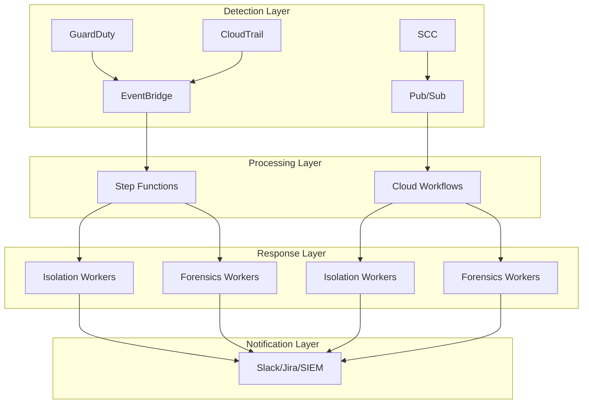

# 🚀 AWS Serverless Security Orchestration, Automation, and Response (SOAR)

 
 


Automated security incident response platform that detects threats and automatically isolates compromised resources while preserving forensic evidence.

## �️ Architecture Overview

### System Architecture
```
Threat Detection → Event Router → Message Queue → Workflow Engine → Workers
     ↓                    ↓              ↓              ↓           ↓
GuardDuty/SCC → EventBridge/Eventarc → SQS/PubSub → Step Functions/Cloud Workflows → Container Workers
```

### AWS Architecture Flow


### Workflow Process
1. **Detection:** GuardDuty detects threats (severity >= 7.0)
2. **Event Routing:** EventBridge routes to SQS queue
3. **Workflow Engine:** Step Functions orchestrates response
4. **Container Workers:** ECS Fargate performs long-running operations
5. **Human Approval:** Manual approval for critical actions
6. **Integrations:** Slack, Jira, SIEM notifications

## 🕵️ Threat Scenario

**Scenario:** An attacker discovers a Remote Code Execution (RCE) vulnerability on your public-facing application and installs a Monero cryptocurrency miner.

**Detection:** The malware begins making outbound DNS requests to known mining pools (e.g., `pool.minexmr.com`). GuardDuty analyzes the DNS logs and flags the instance with a *High-Severity* finding (`CryptoCurrency:EC2/BitcoinTool.B`).

**Response:** Within seconds, the SOAR workflow executes. The instance is yanked off the network, its metadata endpoint is locked down, all active AWS privileges are explicitly revoked, its hard drive is snapshotted for the Blue Team, and the server shuts down.

## 🗂️ Project Structure
- `src/`: Python code for the AWS Lambda responders.
  - `lambda_function.py`: Main EC2 incident response playbook
  - `s3_exfiltration_response.py`: S3 data exfiltration detection and response
  - `iam_compromise_response.py`: IAM compromise detection and response
- `terraform/`: Infrastructure as Code (IaC) definitions to deploy all AWS resources.
- `attack_simulation/`: Bash scripts to emulate malicious behavior and trigger the SOAR logic.

## 🚀 Deployment Instructions

### Prerequisites
- [Terraform](https://www.terraform.io/downloads.html) installed locally.
- AWS CLI installed and configured (`aws configure`).

### Setup
1. Clone the repository and navigate to the terraform directory:
   ```bash
   cd terraform
   ```
2. Initialize and Apply Terraform:
   ```bash
   terraform init
   
   # During apply, it will prompt for the variable: alert_email
   # Enter your email address to receive SOAR notifications
   terraform apply
   ```
3. **Important:** After the first apply, check the email address you provided. AWS SNS requires you to click a confirmation link to subscribe to the security alerts.

## 🛡️ Advanced Features

### Workflow Engine (Step Functions)
- **Human approval** workflows for critical actions
- **Multi-step incident response** with retry logic
- **Parallel execution** for isolation and forensics
- **Error handling** and dead letter queue processing

### Message Queue Layer (SQS)
- **Buffer layer** prevents system overload during attacks
- **Dead Letter Queue** handles failed processing
- **Batch processing** for improved performance
- **Cross-account message routing**

### Container Workers (ECS Fargate)
- **Long-running operations** (15+ minute forensic scans)
- **Full environment** access for comprehensive analysis
- **Scalable compute** with auto-scaling
- **Health monitoring** and graceful degradation

### Multi-Account Security
- **Centralized security account** with cross-account roles
- **GuardDuty master/member** configuration
- **Cross-account incident response** capabilities
- **Secure role assumption** with external IDs

### Integrations
- **Slack/Teams** for real-time notifications
- **Jira/ServiceNow** for ticket management
- **SIEM integration** (Splunk, Chronicle, Elastic)
- **Threat intelligence** feeds

## 🚀 Deployment

### Environment Structure
```
terraform/
├── modules/                    # Reusable modules
│   ├── network/               # VPC, subnets, security groups
│   ├── soar/                  # Core SOAR infrastructure
│   ├── events/                # EventBridge and routing
│   ├── security/              # Multi-account security
│   └── integrations/          # Slack, Jira, SIEM
├── environments/               # Environment-specific configs
│   ├── dev/                   # Development environment
│   ├── staging/               # Staging environment
│   └── prod/                  # Production environment
└── global/                    # Global resources and state
```

### Quick Deploy
```bash
# Deploy SOAR platform
cd aws-serverless-soar
./scripts/deploy.sh prod

# Configure integrations
aws ssm put-parameter \
  --name "/soar/slack/webhook_url" \
  --value "${SLACK_WEBHOOK_URL}" \
  --type "SecureString"
```

## 📊 Security Coverage

| Threat Type | Detection | Response Time | Advanced Features |
|-------------|-----------|---------------|-------------------|
| EC2 Compromise | GuardDuty | < 30s | Workflow approval, container forensics |
| S3 Exfiltration | CloudTrail | < 60s | Cross-account response, SIEM integration |
| IAM Compromise | CloudTrail | < 45s | Multi-project security, ticketing |
| DDoS Attacks | VPC Flow Logs | < 15s | Queue buffering, auto-scaling |

## 🔧 Configuration

### Variables
- `worker_desired_count`: Container worker instances (prod: 3, dev: 1)
- `approval_wait_time`: Human approval timeout (prod: 3600s, dev: 300s)
- `enable_multi_account`: Cross-account security (default: true)
- `enable_integrations`: Slack/Jira/SIEM (default: true)

### Integration Setup
```bash
# Slack integration
aws ssm put-parameter --name "/soar/slack/webhook_url" --value "URL" --type "SecureString"

# Jira integration  
aws ssm put-parameter --name "/soar/jira/api_token" --value "TOKEN" --type "SecureString"

# SIEM integration
aws ssm put-parameter --name "/soar/siem/api_key" --value "KEY" --type "SecureString"
```
