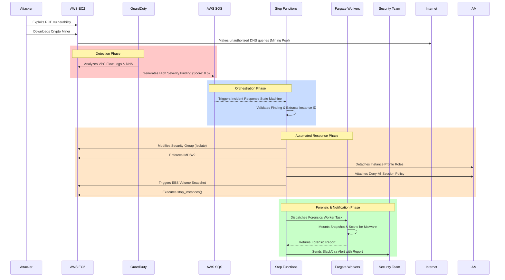

# 🚀 AWS Serverless Security Orchestration, Automation, and Response (SOAR)

 
 


Automated security incident response platform that detects threats and automatically isolates compromised resources while preserving forensic evidence.

**[🇬🇧 English Architecture Guide](./ARCHITECTURE.md) | [🇻🇳 Bản giải thích tiếng Việt](./ARCHITECTURE_vi.md)**

## Architecture Overview

### System Architecture
```
Threat Detection → Event Router → Message Queue → Workflow Engine → Workers
     ↓                    ↓              ↓              ↓           ↓
GuardDuty/SCC → EventBridge/Eventarc → SQS/PubSub → Step Functions/Cloud Workflows → Container Workers
```

### Logical Data Flow


### Workflow Process
1. **Detection:** GuardDuty detects threats (severity >= 7.0)
2. **Event Routing:** EventBridge routes to SQS queue
3. **Workflow Engine:** Step Functions orchestrates response
4. **Container Workers:** ECS Fargate performs long-running operations
5. **Human Approval:** Manual approval for critical actions
6. **Integrations:** Slack, Jira, SIEM notifications

### 🖼️ High-Level Architecture


## 🕵️ Threat Scenario

**Scenario:** An attacker discovers a Remote Code Execution (RCE) vulnerability on your public-facing application and installs a Monero cryptocurrency miner.

**Detection:** The malware begins making outbound DNS requests to known mining pools (e.g., `pool.minexmr.com`). GuardDuty analyzes the DNS logs and flags the instance with a *High-Severity* finding (`CryptoCurrency:EC2/BitcoinTool.B`).

**Response Flow:**
1. Within seconds, the SOAR workflow executes.
2. The instance is yanked off the network.
3. Its metadata endpoint is locked down. 
4. All active AWS privileges are explicitly revoked.
5. Its hard drive is snapshotted for the Blue Team.
6. The server shutting down.

### Timeline/Response Flow

```mermaid
gantt
    title SOAR Incident Response Timeline
    dateFormat  s
    axisFormat  %S
    
    section Detection
    GuardDuty Analyzes Logs     :a1, 0, 10s
    EventBridge Routes Finding  :a2, after a1, 2s
    
    section Automated Response
    SQS Buffers Message         :a3, after a2, 1s
    SFN Validates Event         :a4, after a3, 2s
    EC2 Network Isolation       :crit, a5, after a4, 3s
    IAM Role Detachment         :crit, a6, after a5, 2s
    IMDSv2 Enforcement          :a7, after a6, 2s
    
    section Forensics
    EBS Volume Snapshotting     :a8, after a7, 15s
    EC2 Instance Shutdown       :a9, after a8, 5s
    Fargate Malware Scan        :a10, after a9, 45s
    
    section Notification
    Compile Final Report        :a11, after a10, 2s
    Dispatch Slack/Jira Alert   :a12, after a11, 1s
```


## 🗂️ Project Structure
- `src/`: Python code for the AWS Lambda responders.
  - `lambda_function.py`: Main EC2 incident response playbook
  - `s3_exfiltration_response.py`: S3 data exfiltration detection and response
  - `iam_compromise_response.py`: IAM compromise detection and response
  - `core/event_normalizer.py`: Unified event normalization (→ `UnifiedIncident`)
  - `core/correlator.py`: Cross-cloud incident correlation engine
  - `integrations/anomaly_detector.py`: ML anomaly detection (Isolation Forest)
  - `integrations/scoring.py`: Risk scoring engine with anomaly boost
  - `integrations/intel.py`: Multi-source threat intelligence (VirusTotal, AbuseIPDB)
  - `core/process_containment.py`: Process-level containment via SSM Run Command
  - `core/audit_logger.py`: Structured audit trail with CloudWatch/S3 archival
- `terraform/`: Infrastructure as Code (IaC) definitions to deploy all AWS resources.
- `attack_simulation/`: Interactive Attack Simulator Container (Docker wrapper for scripts targeting EC2, S3, and IAM).

## 🥊 Attack Simulator (New!)

To test the SOAR capabilities, a powerful built-in Red Team Docker container is provided.
You do not need to export credentials manually; the container maps your local AWS credentials automatically.

```bash
# From the root of this project:
docker compose run --rm attacker
```

This will launch an interactive menu allowing you to:
1. Trigger the EC2 Crypto Miner
2. Trigger S3 Exfiltration
3. Trigger IAM SSRF Compromise

## 🛡️ Advanced Features

### Workflow Engine (Step Functions)
- **Human approval** workflows for critical actions
- **Multi-step incident response** with retry logic
- **Parallel execution** for isolation and forensics
- **Error handling** and dead letter queue processing

### Message Queue Layer (SQS)
- **Buffer layer** prevents system overload during attacks
- **Dead Letter Queue** handles failed processing
- **Batch processing** for improved performance
- **Cross-account message routing**

### Container Workers (ECS Fargate)
- **Long-running operations** (15+ minute forensic scans)
- **Full environment** access for comprehensive analysis
- **Scalable compute** with auto-scaling
- **Health monitoring** and graceful degradation

### Multi-Account Security
- **Centralized security account** with cross-account roles
- **GuardDuty master/member** configuration
- **Cross-account incident response** capabilities
- **Secure role assumption** with external IDs

### Integrations
- **Slack/Teams** for real-time notifications
- **Jira/ServiceNow** for ticket management
- **SIEM integration** (Splunk, Chronicle, Elastic)
- **Threat intelligence** feeds (VirusTotal, AbuseIPDB)
- **Automated Scoring Engine** for decision-based orchestration

### Multi-Cloud Orchestration
- **Unified Event Normalizer** converts GuardDuty/CloudTrail events into a standard `UnifiedIncident` schema
- **Incident Correlator** groups related alerts by shared IOCs (IP, actor, ±5 min time window)
- **Campaign Detection** via BFS clustering for multi-stage attack identification

### AI/ML Anomaly Detection
- **Isolation Forest** model for behavioral anomaly detection
- **Z-Score Fallback** when ML model is not yet trained
- **Feature Vector**: `hour_of_day`, `day_of_week`, `ip_reputation_score`, `action_risk_level`, `request_frequency`
- **Enhanced Scoring**: anomaly boost (+15) automatically raises risk level

### Process-Level Containment (SSM)
- **Kill malicious processes** directly on EC2 via SSM Run Command
- **Quarantine suspicious files** to `/var/quarantine`
- **Suspicious process detection** (xmrig, cryptominer, kinsing, etc.)
- **Containment hierarchy**: Function > Process > Permissions > Network

### Audit Trail & Compliance
- **Immutable audit logging** for all SOAR actions (containment, scoring, approvals)
- **CloudWatch Logs** integration for real-time audit streaming
- **S3 archival** for long-term audit retention and compliance
- **Filterable audit queries** by resource, action type, or time range

## 🚀 Deployment

### Prerequisites
- [Terraform](https://www.terraform.io/downloads.html) installed locally.
- AWS CLI installed and configured (`aws configure`).

### Setup
1. Clone the repository and navigate to the terraform directory:
   ```bash
   cd terraform
   ```
2. Initialize and Apply Terraform:
   ```bash
   terraform init
   
   # During apply, it will prompt for the variable: alert_email
   # Enter your email address to receive SOAR notifications
   terraform apply
   ```
3. **Important:** After the first apply, check the email address you provided. AWS SNS requires you to click a confirmation link to subscribe to the security alerts.

### Environment Structure
```
terraform/
├── modules/                    # Reusable modules
│   ├── network/               # VPC, subnets, security groups
│   ├── soar/                  # Core SOAR infrastructure
│   ├── events/                # EventBridge and routing
│   ├── security/              # Multi-account security
│   └── integrations/          # Slack, Jira, SIEM
├── environments/               # Environment-specific configs
│   ├── dev/                   # Development environment
│   ├── staging/               # Staging environment
│   └── prod/                  # Production environment
└── global/                    # Global resources and state
```

### Quick Deploy
```bash
# Deploy SOAR platform
cd aws-serverless-soar
./scripts/deploy.sh prod

# Configure integrations
aws ssm put-parameter \
  --name "/soar/slack/webhook_url" \
  --value "${SLACK_WEBHOOK_URL}" \
  --type "SecureString"
```

## 📊 Security Coverage

| Threat Type | Detection | Response Time | Risk Decision | Advanced Features |
|-------------|-----------|---------------|---------------|-------------------|
| EC2 Compromise | GuardDuty | < 30s | Scoring Engine | Workflow approval, container forensics |
| S3 Exfiltration | CloudTrail | < 60s | Scoring Engine | Multi-Intel enrichment, SIEM integration |
| IAM Compromise | CloudTrail | < 45s | Scoring Engine | Decision-based orchestration, ticketing |
| DDoS Attacks | VPC Flow Logs | < 15s | Aggregated | Queue buffering, auto-scaling |

## 🔧 Configuration

### Local Development Environment
A `.env.example` file is provided in the repository root documenting all OS environment variables used by the playbooks. 
- For local testing, copy this file to `.env` and adjust the values.
- In production, these parameters are securely injected into the Lambda runtime by Terraform.

### Variables
- `worker_desired_count`: Container worker instances (prod: 3, dev: 1)
- `approval_wait_time`: Human approval timeout (prod: 3600s, dev: 300s)
- `enable_multi_account`: Cross-account security (default: true)
- `enable_integrations`: Slack/Jira/SIEM (default: true)

### Integration Setup
```bash
# Slack integration
aws ssm put-parameter --name "/soar/slack/webhook_url" --value "URL" --type "SecureString"

# Jira integration
aws ssm put-parameter --name "/soar/jira/url" --value "https://your-domain.atlassian.net" --type "String"
aws ssm put-parameter --name "/soar/jira/user" --value "email@example.com" --type "String"
aws ssm put-parameter --name "/soar/jira/api_token" --value "TOKEN" --type "SecureString"
aws ssm put-parameter --name "/soar/jira/project_key" --value "SEC" --type "String"

# SIEM integration
aws ssm put-parameter --name "/soar/siem/api_key" --value "KEY" --type "SecureString"
```

## 💰 Cost Estimation

Since this platform is built entirely on native Serverless architecture, the cost is heavily optimized and strictly **pay-as-you-go**. There is virtually zero idle cost.

### Estimated Monthly Cost (Low/Moderate Traffic): `~$5 - $15 / month`
- **AWS GuardDuty:** Priced per GB of VPC Flow Logs / CloudTrail events analyzed. For a small/medium environment, this is usually under **$5-10/month**.
- **AWS Step Functions:** 4,000 free state transitions per month. After that, \$0.025 per 1,000 standard transitions. SOAR workflows only trigger on critical findings, so cost is negligible (**< $1/month**).
- **AWS Lambda:** 1 Million free requests/month. You will likely never exceed the free tier for SOAR actions (**$0**).
- **AWS SQS / EventBridge:** Both offer massive free tiers (1+ Million events). Usage for this platform is negligible (**$0**).
- **AWS ECS Fargate:** Billed per second of compute for forensics tasks. Since tasks only spin up during an incident and run for ~5-15 mins, cost is extremely low (**< $2/month**).
- **Threat Intel (VirusTotal/AbuseIPDB):** Free Community API keys limit queries to ~500-1000/day. More than enough for SOAR alerts (**$0**).

*Note: Enabling Multi-Account organizational trails or operating in a high-attack-volume environment will scale costs up proportionally to log volume.*

## 📄 License

This project is licensed under the **Apache License 2.0**. See the [LICENSE](LICENSE) file for details.
