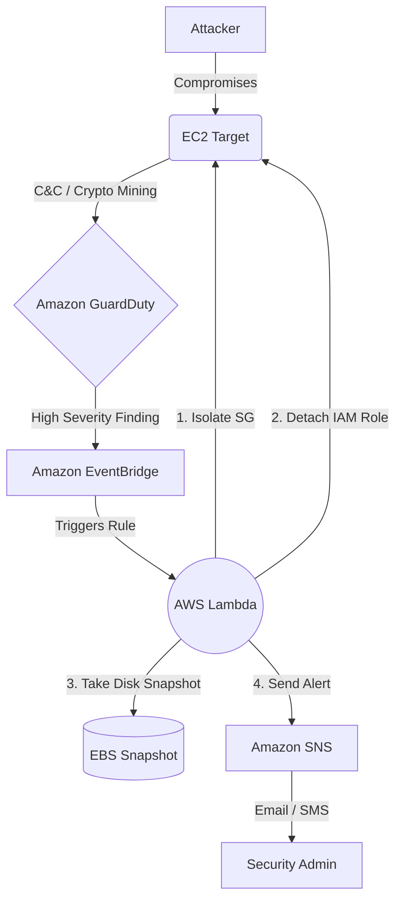

# AWS Serverless Security Orchestration, Automation, and Response (SOAR)

This project demonstrates a fully automated Serverless Incident Response architecture on AWS. It detects malicious activity using Amazon GuardDuty and automatically isolates the compromised EC2 instance while preserving its state for forensic investigation.

## 🏛️ Architecture



The workflow involves:
1. **Detection:** Amazon GuardDuty detects anomalous behavior with severity >= 7.0 (e.g., EC2 communicating with a known C&C server).
2. **Event Routing:** Amazon EventBridge intercepts the GuardDuty finding based on an event rule.
3. **Automation Logic:** An AWS Lambda function (Python/Boto3) is triggered.
4. **Resolution (Response):** 
   - **Isolate:** Modifies the EC2 instance Security Group to an `Isolation SG` (0 ingress/egress).
   - **Revoke:** Disassociates any attached IAM Instance Profiles so the hacker cannot hit AWS APIs.
   - **Preserve:** Takes an EBS Snapshot of the compromised instance for forensics.
   - **Tag:** Tags the instance as `Compromised: True`.
   - **Alert:** Sends an alert notification securely via Amazon SNS.

## 🕵️ Threat Scenario

**Scenario:** An attacker discovers a Remote Code Execution (RCE) vulnerability on your public-facing application and installs a Monero cryptocurrency miner.

**Detection:** The malware begins making outbound DNS requests to known mining pools (e.g., `pool.minexmr.com`). GuardDuty analyzes the DNS logs and flags the instance with a *High-Severity* finding (`CryptoCurrency:EC2/BitcoinTool.B`).

**Response:** Within seconds, the SOAR workflow executes. The instance is yanked off the network, its AWS privileges are revoked, and its hard drive is snapshotted for the Blue Team to legally investigate later.

## 🗂️ Project Structure
- `src/`: Python code for the AWS Lambda responder.
- `terraform/`: Infrastructure as Code (IaC) definitions to deploy all AWS resources.

## 🚀 Deployment Instructions

### Prerequisites
- [Terraform](https://www.terraform.io/downloads.html) installed locally.
- AWS CLI installed and configured (`aws configure`).

### Setup
1. Clone the repository and navigate to the terraform directory:
   ```bash
   cd terraform
   ```
2. Initialize and Apply Terraform:
   ```bash
   terraform init
   
   # During apply, it will prompt for the variable: alert_email
   # Enter your email address to receive SOAR notifications
   terraform apply
   ```
3. **Important:** After the first apply, check the email address you provided. AWS SNS requires you to click a confirmation link to subscribe to the security alerts.

## ⚔️ Simulation Guide: Triggering GuardDuty
Amazon GuardDuty costs money and takes time to learn behavior. To immediately see this SOAR architecture in action without waiting for real hackers, we can generate sample findings.

**Method 1: Using AWS CLI (Easiest)**
Generate sample GuardDuty findings that EventBridge will catch:

```bash
# 1. Get your Detector ID (Terraform output)
aws guardduty list-detectors

# 2. Ask GuardDuty to generate a sample finding for your EC2
aws guardduty create-sample-findings \
  --detector-id <YOUR_DETECTOR_ID> \
  --finding-types "Backdoor:EC2/C&CActivity.B"
```
*Note: Depending on how AWS generates the sample, the sample finding might use a fake Instance ID rather than your actual deployed EC2. But you will still see the Lambda execution trigger in CloudWatch logs.*

**Method 2: Use Attack Simulation Scripts (Realistic)**
Use the provided bash scripts to generate real network traffic patterns that GuardDuty flags as malicious.

1. SSH into the `target_ec2_public_ip` (provided in Terraform outputs).
2. Upload and run the scripts in `attack_simulation/`:
   ```bash
   # Run the fake crypto miner
   chmod +x attack_simulation/crypto_miner.sh
   ./attack_simulation/crypto_miner.sh
   ```
3. **Wait:** GuardDuty typically takes 15-20 minutes to generate and propagate an actual finding for continuous traffic. 
4. **Observe:** Check your email. The SOAR logic will fire, taking an EBS Snapshot, detaching its IAM roles, and destroying your SSH connection (by swapping the Security Group).
