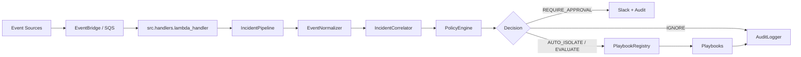
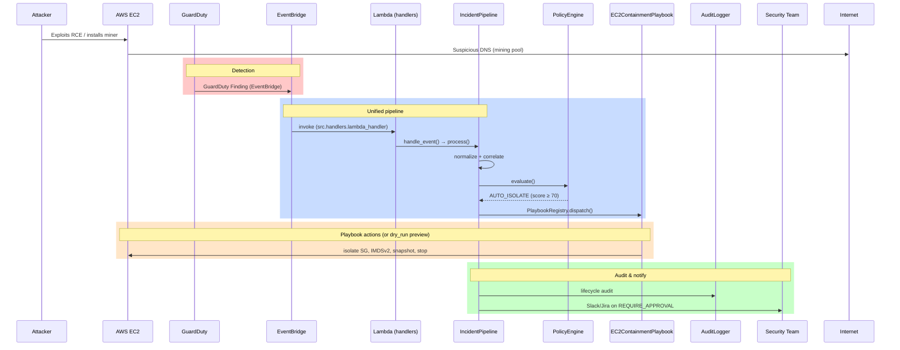
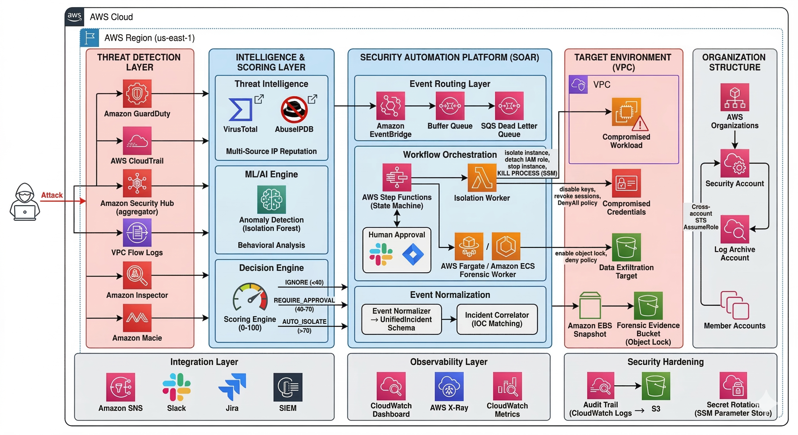
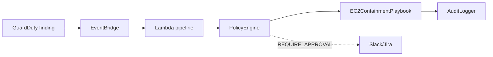

<p align="center">
  
</p>

# 🚀 AWS Serverless Security Orchestration, Automation, and Response (SOAR)

 
 


Automated security incident response platform that detects threats and automatically isolates compromised resources while preserving forensic evidence.

**[🇬🇧 English Architecture Guide](./ARCHITECTURE.md) | [🇻🇳 Bản giải thích tiếng Việt](./ARCHITECTURE_vi.md)**

## Architecture Overview

### Single Incident Pipeline (Production)


```mermaid
flowchart LR
    A[Event Sources] --> B[EventBridge / SQS]
    B --> C[src.handlers.lambda_handler]
    C --> D[IncidentPipeline]
    D --> E[EventNormalizer]
    E --> F[IncidentCorrelator]
    F --> G[PolicyEngine]
    G --> H{Decision}
    H -->|IGNORE| I[AuditLogger]
    H -->|REQUIRE_APPROVAL| J[Slack + Audit]
    H -->|AUTO_ISOLATE / EVALUATE| K[PlaybookRegistry]
    K --> L[Playbooks]
    L --> I
```

**Entry point:** `src/handlers.py` → `handle_event()` (Terraform handler: `src.handlers.lambda_handler` via `scripts/build_lambda_package.ps1`)

**Deprecated:** `lambda_function.py`, `iam_compromise_response.py`, `s3_exfiltration_response.py` — re-export only. Step Functions Terraform modules (if present) are **legacy wiring**, not the business spine. `src/queue_processor.py` routes SQS → `handlers.handle_event()` (no Step Functions fan-out).

### Logical Data Flow

```mermaid
sequenceDiagram
    participant Attacker
    participant EC2 as AWS EC2
    participant GD as GuardDuty
    participant EB as EventBridge
    participant L as Lambda (handlers)
    participant P as IncidentPipeline
    participant PE as PolicyEngine
    participant PB as EC2ContainmentPlaybook
    participant A as AuditLogger
    participant Sec as Security Team

    Attacker->>EC2: Exploits RCE / installs miner
    EC2->>Internet: Suspicious DNS (mining pool)

    rect rgb(255, 200, 200)
        Note over GD,EB: Detection
        GD->>EB: GuardDuty Finding (EventBridge)
    end

    rect rgb(200, 220, 255)
        Note over EB,P: Unified pipeline
        EB->>L: invoke (src.handlers.lambda_handler)
        L->>P: handle_event() → process()
        P->>P: normalize + correlate
        P->>PE: evaluate()
        PE-->>P: AUTO_ISOLATE (score ≥ 70)
        P->>PB: PlaybookRegistry.dispatch()
    end

    rect rgb(255, 230, 200)
        Note over PB,EC2: Playbook actions (or dry_run preview)
        PB->>EC2: isolate SG, IMDSv2, snapshot, stop
    end

    rect rgb(200, 255, 200)
        Note over P,Sec: Audit & notify
        P->>A: lifecycle audit
        P->>Sec: Slack/Jira on REQUIRE_APPROVAL
    end
```

### Workflow Process
1. **Detection:** GuardDuty, CloudTrail, Security Hub, VPC Flow Logs, Inspector, Macie
2. **Transport:** EventBridge → optional SQS buffer (+ DLQ)
3. **Pipeline:** `IncidentPipeline` — normalize → correlate → score → decision → dispatch
4. **Playbooks:** containment logic lives only under `src/playbooks/`
5. **Policy gate:** `IGNORE` (<40) | `REQUIRE_APPROVAL` (40–69) | `AUTO_ISOLATE` (≥70) | `EVALUATE` (domain-specific, e.g. S3 exfil)
6. **Audit:** `AuditLogger` records every phase

### 🖼️ High-Level Architecture


Legacy Step Functions–centric diagram: `images/aws_soar_deprecated_stepfunctions.png`

## 🕵️ Threat Scenario

**Scenario:** An attacker discovers a Remote Code Execution (RCE) vulnerability on your public-facing application and installs a Monero cryptocurrency miner.

**Detection:** The malware begins making outbound DNS requests to known mining pools (e.g., `pool.minexmr.com`). GuardDuty analyzes the DNS logs and flags the instance with a *High-Severity* finding (`CryptoCurrency:EC2/BitcoinTool.B`).

**Response Flow (playbook steps — use `dry_run=True` locally without cloud APIs):**
1. Event reaches `handlers.handle_event()` via EventBridge (optional SQS buffer).
2. `PolicyEngine` scores the incident; high risk → `EC2ContainmentPlaybook`.
3. Playbook may: swap security group, enforce IMDSv2, detach instance profile, snapshot EBS, stop instance.
4. `AuditLogger` records normalize → correlate → score → decision → playbook phases.

### Response phases (logical order — not measured cloud latency)

```mermaid
flowchart LR
    A[GuardDuty finding] --> B[EventBridge]
    B --> C[Lambda pipeline]
    C --> D[PolicyEngine]
    D --> E[EC2ContainmentPlaybook]
    E --> F[AuditLogger]
    D -.->|REQUIRE_APPROVAL| G[Slack/Jira]
```

## 🗂️ Project Structure
- `src/`: Python code for AWS Lambda responders.
  - `handlers.py`: **Single entry** — `handle_event()`, `lambda_handler`
  - `core/pipeline.py`: `IncidentPipeline` (normalize → correlate → policy → dispatch → audit)
  - `core/event_normalizer.py`, `core/correlator.py`, `core/policy.py`, `core/audit_logger.py`
  - `playbooks/`: **Only** containment execution (`ec2_containment`, `s3_exfiltration`, `iam_compromise`, …)
  - `integrations/scoring.py`, `integrations/intel.py`, `integrations/anomaly_detector.py`
  - `lambda_function.py`, `iam_compromise_response.py`, `s3_exfiltration_response.py`: **deprecated** re-exports
- `terraform/`: Infrastructure as Code (IaC) definitions to deploy all AWS resources.
  - `modules/monitoring/`: CloudWatch Dashboard and Alarms
- `attack_simulation/`: Interactive Attack Simulator Container (Docker wrapper for scripts targeting EC2, S3, and IAM).

## 🥊 Attack Simulator

To test the SOAR capabilities, a powerful built-in Red Team Docker container is provided.
You do not need to export credentials manually; the container maps your local AWS credentials automatically.

```bash
# From the root of this project:
docker compose run --rm attacker
```

This will launch an interactive menu allowing you to:
1. Trigger the EC2 Crypto Miner / Ransomware
2. Trigger S3 Exfiltration
3. Trigger IAM SSRF Compromise

## 🛡️ Advanced Features

### 🧠 AI/ML Threat Intelligence (Phase 9)
- **Threat Classifier**: ML-driven engine that predicts incident severity, maps to MITRE ATT&CK TTPs, and auto-generates response playbooks based on historical attack patterns.
- **Behavioral Analytics**: Establishes behavioral baselines for users and service accounts to detect anomalies in IP location, temporal patterns (off-hours), and API action frequencies.
- **Attack Forecaster**: Predictive security module that analyzes historical incidents to forecast probable future attack vectors and generates proactive security recommendations.

### Unified Incident Pipeline
- **Single hot path:** `handlers.handle_event()` → `IncidentPipeline.process()`
- **8 playbooks** registered in `handlers.py`
- **Human approval:** `REQUIRE_APPROVAL` (score 40–69) → Slack notify, no auto-remediation
- **Legacy:** Step Functions modules in Terraform (if enabled) do not contain playbook logic

### Message Queue Layer (SQS)
- **Buffer layer** prevents system overload during attacks
- **Dead Letter Queue** handles failed processing
- **Batch processing** for improved performance
- **Cross-account message routing**

### Container Workers (ECS Fargate)
- **Optional Terraform module** for long-running forensic scans (not on the Lambda hot path)
- Forensic snapshots and metadata are also created inside playbooks (e.g. `EC2ContainmentPlaybook`)

### Multi-Account Security
- **Centralized security account** with cross-account roles
- **GuardDuty master/member** configuration
- **Cross-account incident response** capabilities
- **Secure role assumption** with external IDs

### Integrations
- **Slack/Teams** for real-time notifications
- **Jira/ServiceNow** for ticket management
- **SIEM integration** (Splunk, Chronicle, Elastic)
- **Threat intelligence** feeds (VirusTotal, AbuseIPDB)
- **Automated Scoring Engine** for decision-based orchestration

### Multi-Cloud Orchestration
- **Unified Event Normalizer** converts GuardDuty/CloudTrail events into a standard `UnifiedIncident` schema
- **Incident Correlator** groups related alerts by shared IOCs (IP, actor, ±5 min time window)
- **Campaign Detection** via BFS clustering for multi-stage attack identification

### AI/ML Anomaly Detection
- **Isolation Forest** model for behavioral anomaly detection
- **Z-Score Fallback** when ML model is not yet trained
- **Feature Vector**: `hour_of_day`, `day_of_week`, `ip_reputation_score`, `action_risk_level`, `request_frequency`
- **Enhanced Scoring**: anomaly boost (+15) automatically raises risk level

### Process-Level Containment (SSM)
- **Kill malicious processes** directly on EC2 via SSM Run Command
- **Quarantine suspicious files** to `/var/quarantine`
- **Suspicious process detection** (xmrig, cryptominer, kinsing, etc.)
- **Containment hierarchy**: Function > Process > Permissions > Network

### Audit Trail & Compliance
- **Immutable audit logging** for all SOAR actions (containment, scoring, approvals)
- **CloudWatch Logs** integration for real-time audit streaming
- **S3 archival** for long-term audit retention and compliance
- **Filterable audit queries** by resource, action type, or time range

### Monitoring & Observability (Terraform)
- **CloudWatch Dashboard** with incident volume, error rate, MTTR, SQS depth
- **CloudWatch Alarms** for Lambda errors and DLQ backlogs
- **Lambda / pipeline audit** via `AuditLogger` → CloudWatch Logs
- **SLO/SLI metrics** for playbook success rate

### Secret Rotation
- **Automated key age detection** for all SOAR API keys
- **SSM Parameter Store rotation** with audit trail
- **90-day rotation policy** with configurable thresholds
- **Rotation report** for compliance dashboards

### GenAI Incident Summarization (Amazon Bedrock)
- **AI-powered alert summaries** via Claude 3 Haiku injected into Slack notifications
- **Automatic fallback** to rule-based templates when Bedrock is unavailable
- **Actionable context**: what happened, affected resource, severity, recommended next step

## 🚀 Deployment

We provide a fully automated deployment script for the entire platform.

**👉 Please see the comprehensive [Deployment Guide (Deployment.md)](./Deployment.md) for full pre-requisites, step-by-step instructions, and troubleshooting.**

### Environment Structure
```
terraform/
├── modules/                    # Reusable modules
│   ├── network/               # VPC, subnets, security groups
│   ├── soar/                  # Core SOAR infrastructure
│   ├── events/                # EventBridge and routing
│   ├── security/              # Multi-account security
│   └── integrations/          # Slack, Jira, SIEM
├── environments/               # Environment-specific configs
│   ├── dev/                   # Development environment
│   ├── staging/               # Staging environment
│   └── prod/                  # Production environment
└── global/                    # Global resources and state
```

### TL;DR Quick Deploy
```bash
# 1. Clone the repository
git clone https://github.com/thtcsec/AWS-Serverless-SOAR.git
cd AWS-Serverless-SOAR

# Optional: quick local diagnostics on Windows / PowerShell
.\scripts\doctor.ps1

# 2. Run the deployment script (deploys Terraform, builds Fargate containers, sets up SSM)
./scripts/deploy.sh prod deploy

# 3. Configure Integrations (Slack/Jira)
aws ssm put-parameter --name "/soar/slack/webhook_url" --value "YOUR_WEBHOOK_URL" --type "SecureString"
```

## 📊 Security Coverage

| Threat Type | Detection | Playbook | Notes |
|-------------|-----------|----------|-------|
| EC2 Ransomware/Compromise | GuardDuty | EC2ContainmentPlaybook | Scoring + optional approval |
| S3 Exfiltration | CloudTrail | S3ExfiltrationPlaybook | `EVALUATE` decision path |
| IAM Compromise | CloudTrail | IAMCompromisePlaybook | Key revoke, DenyAll |
| EKS Pod Compromise | GuardDuty | EKSPodIsolationPlaybook | Pod eviction |
| RDS Abuse | CloudTrail | RDSCompromisePlaybook | Forensic snapshot |
| API / WAF abuse | WAF / API GW | APIGatewayAbusePlaybook | Rate / block patterns |
| CI/CD supply chain | CodePipeline / CloudTrail | CICDSupplyChainPlaybook | Pipeline lockdown |

## 🔧 Configuration

### Local Development Environment
A `.env.example` file is provided in the repository root documenting all OS environment variables used by the playbooks. 
- For local testing, copy this file to `.env` and adjust the values.
- In production, these parameters are securely injected into the Lambda runtime by Terraform.
- On Windows, run `.\scripts\doctor.ps1` for a quick readiness check of `.venv`, AWS auth, Terraform, Docker, and next-step commands.

### Dry-Run Preview
Use the playbook preview mode when you want to inspect the remediation plan without changing cloud resources.

```python
from src.handlers import lambda_handler

event["dry_run"] = True
preview = lambda_handler(event, None)
```

The response body includes the selected playbook, target resource, and ordered `planned_actions`.

### Variables
- `worker_desired_count`: Container worker instances (prod: 3, dev: 1)
- `approval_wait_time`: Human approval timeout (prod: 3600s, dev: 300s)
- `enable_multi_account`: Cross-account security (default: true)
- `enable_integrations`: Slack/Jira/SIEM (default: true)

### Integration Setup
```bash
# Slack integration
aws ssm put-parameter --name "/soar/slack/webhook_url" --value "URL" --type "SecureString"

# Jira integration
aws ssm put-parameter --name "/soar/jira/url" --value "https://your-domain.atlassian.net" --type "String"
aws ssm put-parameter --name "/soar/jira/user" --value "email@example.com" --type "String"
aws ssm put-parameter --name "/soar/jira/api_token" --value "TOKEN" --type "SecureString"
aws ssm put-parameter --name "/soar/jira/project_key" --value "SEC" --type "String"

# SIEM integration
aws ssm put-parameter --name "/soar/siem/api_key" --value "KEY" --type "SecureString"
```

## 💰 Cost Estimation

Since this platform is built entirely on native Serverless architecture, the cost is heavily optimized and strictly **pay-as-you-go**. There is virtually zero idle cost.

### Estimated Monthly Cost (Low/Moderate Traffic): `~$5 - $15 / month`
- **AWS GuardDuty:** Priced per GB of VPC Flow Logs / CloudTrail events analyzed. For a small/medium environment, this is usually under **$5-10/month**.
- **AWS Lambda:** 1 Million free requests/month. Hot path is one invocation per incident (**$0** at lab scale).
- **AWS Step Functions:** Only if legacy Terraform modules are enabled — **not** the application spine (**$0** when unused).
- **AWS SQS / EventBridge:** Both offer massive free tiers (1+ Million events). Usage for this platform is negligible (**$0**).
- **AWS ECS Fargate:** Billed per second of compute for forensics tasks. Since tasks only spin up during an incident and run for ~5-15 mins, cost is extremely low (**< $2/month**).
- **Threat Intel (VirusTotal/AbuseIPDB):** Free Community API keys limit queries to ~500-1000/day. More than enough for SOAR alerts (**$0**).

*Note: Enabling Multi-Account organizational trails or operating in a high-attack-volume environment will scale costs up proportionally to log volume.*

## 📄 License

This project is licensed under the **Apache License 2.0**. See the [LICENSE](LICENSE) file for details.
